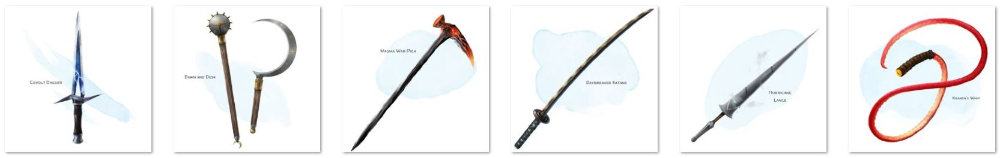

# SmartContract ERC721 NFT
um projeto de contrato inteligente para games NFT.
Funçoes de contrato: GM criar novos NFT's, Batalha basica Atk/Def e Transaçoes. 💢

## Tecnologias utilizadas
- Solidity.
- RemixIDE.
- OpenZeppelin Framework. 
- Ganache.
- MetaMask.
- IPFS.

